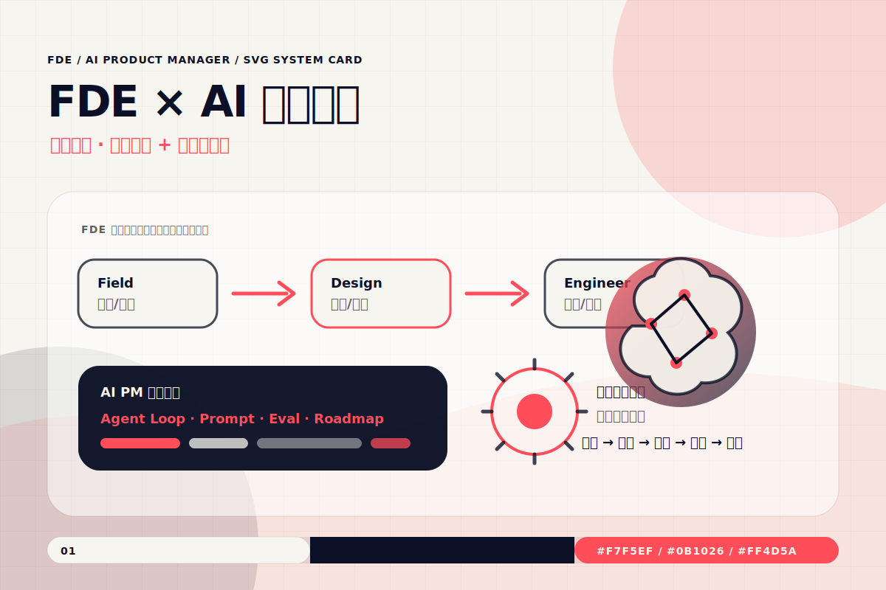
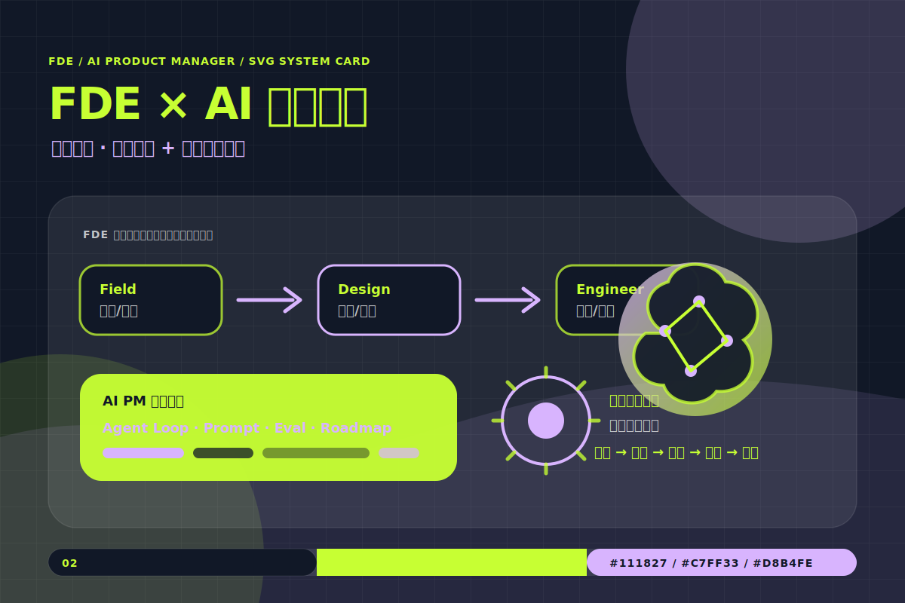
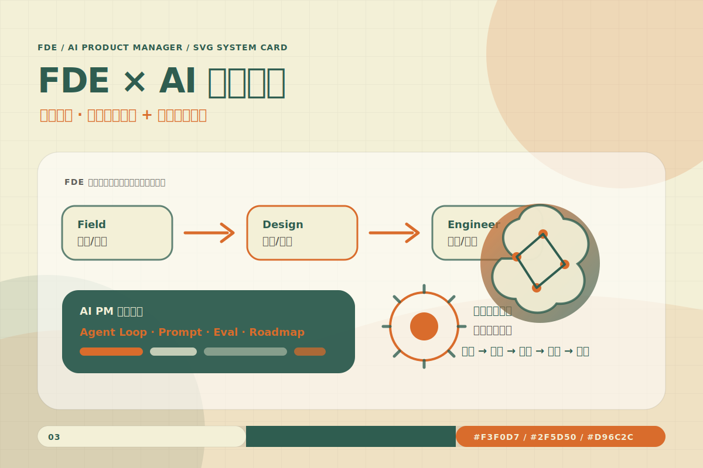
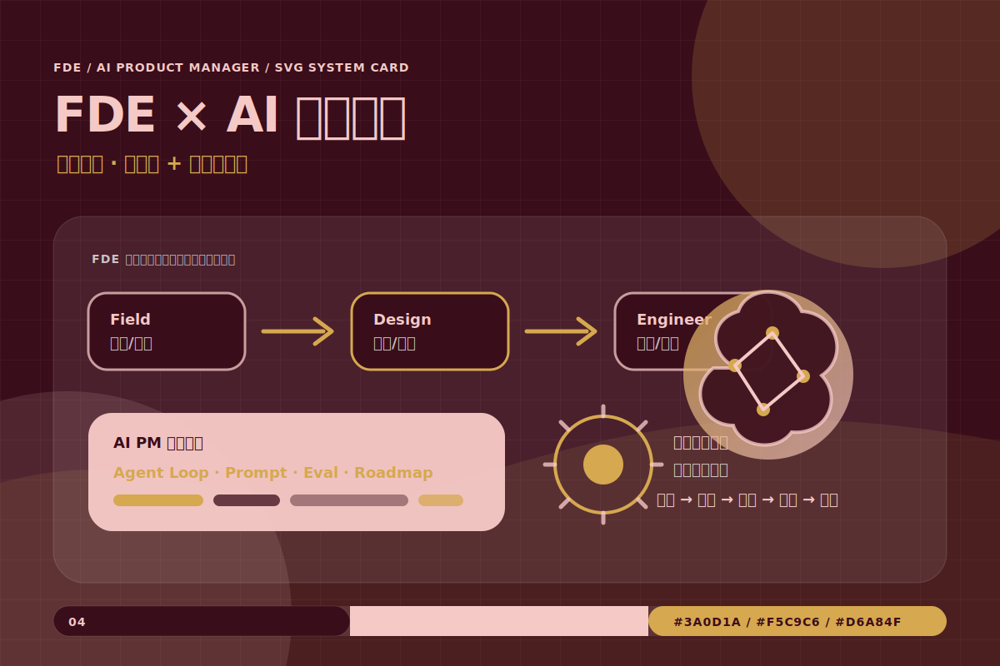
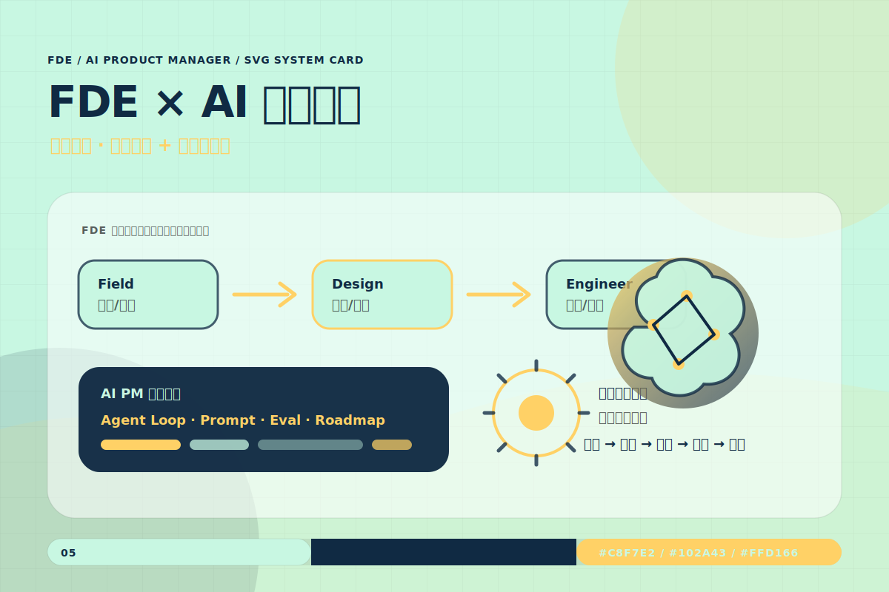
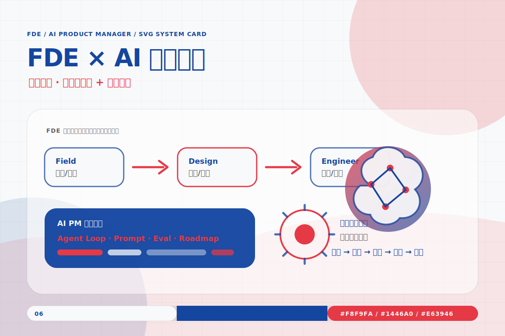
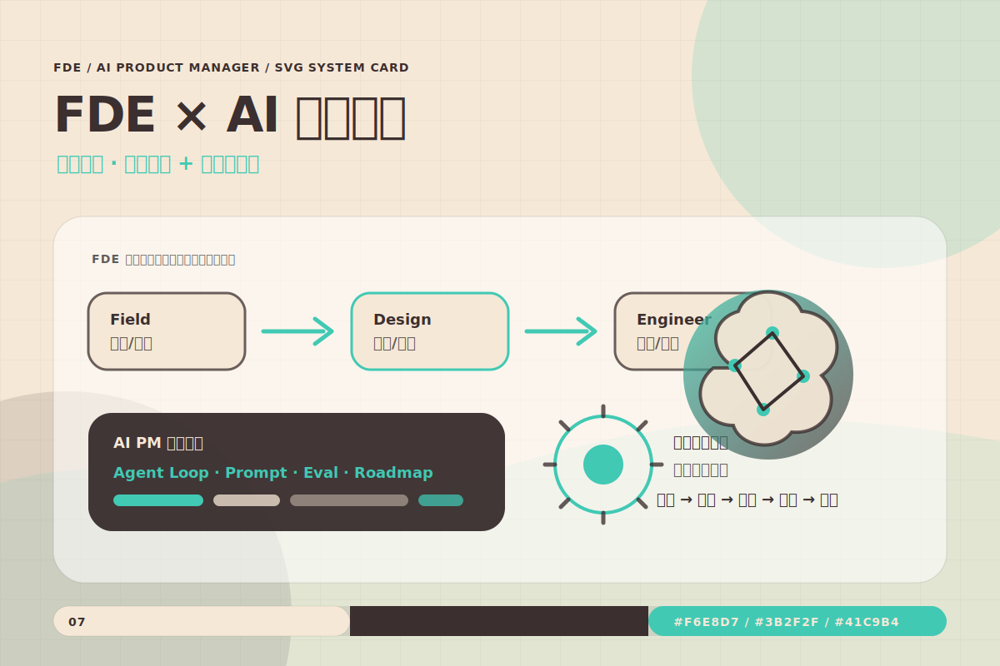
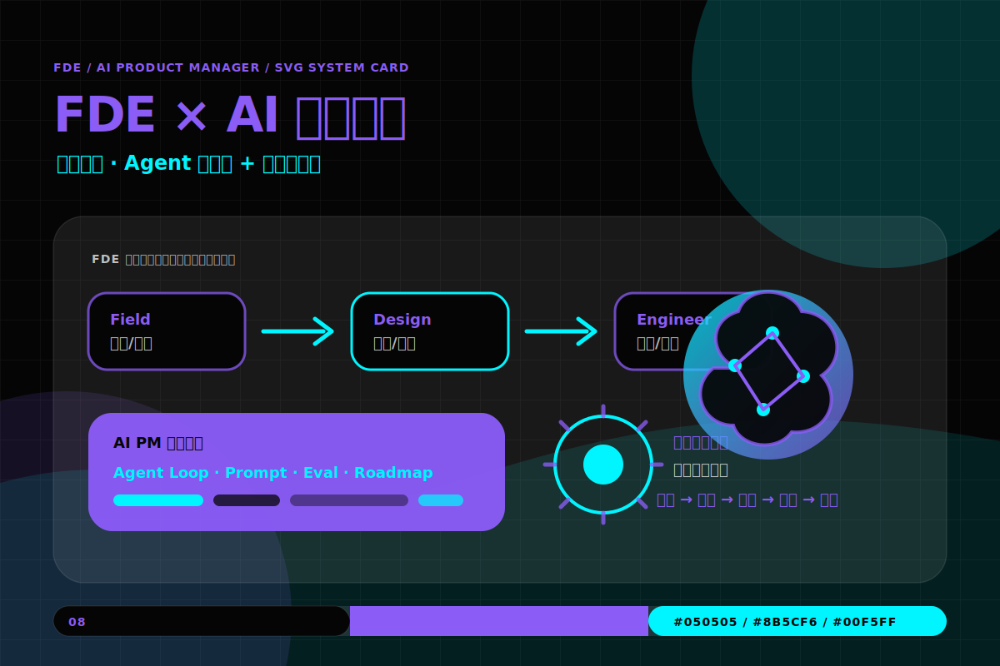
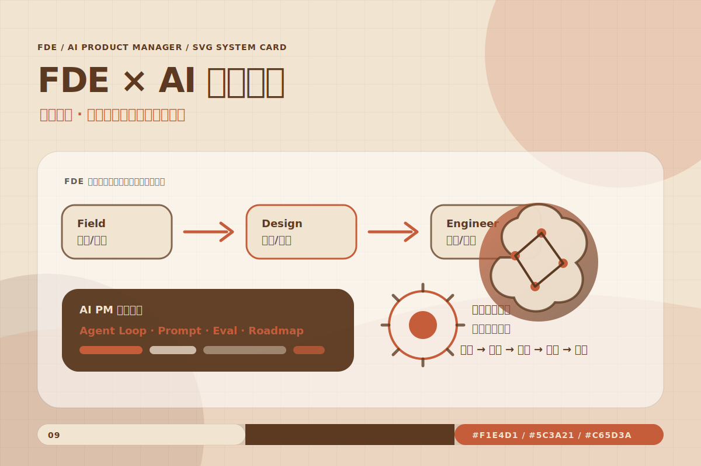
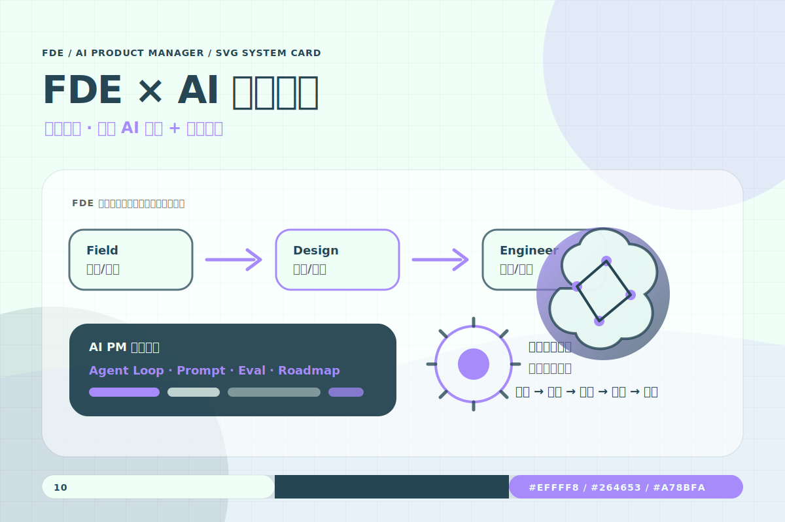

# SVG Design System Skill

[English README](README.md)


**一个用于生成有真实信息层级的 SVG 图表视觉设计系统。**

`svg-design-system` 是一个同时支持 Codex 和 Claude Code 的 SVG 图表设计系统 Skill。它面向文章可视化、产品分析、业务流程、系统架构、项目汇报和飞书/Lark 文档画板场景，帮助 Agent 生成有信息层级、有统一视觉规则、且可复用的 SVG 图。

这个仓库包含 `LICENSE` 文件。重要变更记录见 [`CHANGELOG.md`](CHANGELOG.md)。

---

## 版本更新摘要

| 版本 | 重点 | 更新内容 |
|---|---|---|
| v1.0 | SVG 图表设计系统首版 | 新增核心 Skill 指令、10 组三色命名配色、设计 token、7 类图表生成配方、示例 SVG 卡片、飞书/Lark 画板安全上传流程、独立中英文 README 和 SVG 示例画廊。 |

---

## 可选前置条件：飞书/Lark 画板工具

普通 SVG 生成不需要额外依赖；Agent 可以直接在对话中产出 SVG，或在工作区写入 `.svg` 文件。

如果需要把图上传到飞书/Lark 文档画板，建议先检查：

```powershell
lark-cli --version
lark-cli auth status
npx -y @larksuite/whiteboard-cli@^0.2.11 -v
```

当飞书/Lark 权限或工具不可用时，Skill 仍然可以生成 board-safe SVG，并列出后续上传步骤。

---

## 给 AI Agent 的快速安装

Codex:

```powershell
$repoPath = "$env:USERPROFILE\.codex\skill-repos\Svg-design-system"
$skillPath = "$env:USERPROFILE\.codex\skills\svg-design-system"
if (Test-Path $repoPath) {
  Set-Location $repoPath
  git pull
} else {
  git clone https://github.com/VioletScar-Hui/Svg-design-system.git $repoPath
}
New-Item -ItemType Directory -Force $skillPath | Out-Null
Copy-Item -Path "$repoPath\svg-design-system\*" -Destination $skillPath -Recurse -Force
```

Claude Code:

```powershell
$repoPath = "$env:USERPROFILE\.claude\skill-repos\Svg-design-system"
$skillPath = "$env:USERPROFILE\.claude\skills\svg-design-system"
if (Test-Path $repoPath) {
  Set-Location $repoPath
  git pull
} else {
  git clone https://github.com/VioletScar-Hui/Svg-design-system.git $repoPath
}
New-Item -ItemType Directory -Force $skillPath | Out-Null
Copy-Item -Path "$repoPath\svg-design-system\*" -Destination $skillPath -Recurse -Force
```

安装后验证：

```powershell
Test-Path "$env:USERPROFILE\.codex\skills\svg-design-system\SKILL.md"
Get-Content "$env:USERPROFILE\.codex\skills\svg-design-system\SKILL.md" -TotalCount 8
```

Claude Code 用户把路径替换为 `$env:USERPROFILE\.claude\skills\svg-design-system\SKILL.md` 即可。

安装或更新后，需要重启 Codex 或 Claude Code，让 Skill 索引重新加载。

---

## 人类用户快速开始

安装后可以直接向 Agent 提出这类请求：

```text
把这段文章整理成一张适合公众号使用的 SVG 架构图。
```

```text
帮我把这个产品流程画成流程图，输出 SVG，风格要偏冷静专业。
```

```text
把这套 Agent 工作流做成飞书文档画板可用的图，注意要 board-safe。
```

正常情况下，Agent 应该完成：

- 确认使用场景和是否需要上传到飞书/Lark 画板。
- 根据内容结构选择图表类型。
- 先搭建五级信息层级，再进行视觉设计。
- 从 10 组命名配色中选择合适方案。
- 输出 SVG、可选 PNG，或飞书/Lark 画板安全版本。

---

## 示例画廊

下面 10 张 SVG 示例展示同一张信息卡片在 10 组命名配色下的效果。卡片里的 FDE × AI PM 文案只是示例内容，不是固定模板；它主要用于展示配色角色、明暗适配、信息层级和强调色使用方式。

| 配色 | 预览 |
|---|---|
| 01 深海珊瑚 |  |
| 02 酸性幻夜 |  |
| 03 森林焦糖 |  |
| 04 酒红鎏金 |  |
| 05 海风日光 |  |
| 06 冷白警醒 |  |
| 07 奶油绿洲 |  |
| 08 赛博霓虹 |  |
| 09 荒野陶土 |  |
| 10 薄荷梦境 |  |

---

## 适合什么场景？

当用户需要绘制、设计或生成以下图表时，应触发这个 Skill：

- 流程图
- 矩阵图
- 架构图
- 时间轴
- 关系图 / 节点图
- 循环图
- 对比图

即使用户没有说出具体图表名称，只要描述的是下面这些结构，也适合使用：步骤、流程、管线、因果链、二维分类、优先级矩阵、系统层级、模块组成、时间演进、多实体关系、闭环反馈、A 与 B 对比、把文章转成图、把图放入飞书/Lark 文档画板。

---

## 输出内容

Skill 可以产出：

- 独立 SVG 图表。
- 适合粘贴到 PPT、文档、公众号或报告里的 PNG 渲染图。
- 适合飞书/Lark 文档画板的 board-safe SVG。
- 带有语义说明的配色和 token 选择。
- 覆盖五级信息层级的图表布局。

| 层级 | 问题 | 在图中体现为 |
|---|---|---|
| L1 一级信息 | 这张图讲什么？ | 标题区 |
| L2 二级信息 | 核心模块有哪些？ | 主盒子 / 主节点 |
| L3 三级信息 | 模块之间是什么关系？ | 箭头、连线、分组、布局 |
| L4 四级信息 | 重点结论是什么？ | 强调色 callout |
| L5 五级信息 | 视觉记忆点是什么？ | 独特符号、隐喻或形状 |

---

## 核心能力

### 根据内容选择图表

Skill 会根据内容结构选择图表类型，而不是默认把所有内容都画成流程图。比如：顺序步骤适合流程图，两个独立维度适合矩阵图，系统模块适合架构图，时间演进适合时间轴，闭环反馈适合循环图。

### 10 组命名配色

每组配色固定为三个角色：

| 角色 | 用途 |
|---|---|
| 底色 | 画布背景，决定浅色或深色模式 |
| 主墨色 | 文字、边框、连线和主体结构 |
| 高能强调 | 核心结论、关键箭头、最高价值提示 |

目前包含：`深海珊瑚`、`酸性幻夜`、`森林焦糖`、`酒红鎏金`、`海风日光`、`冷白警醒`、`奶油绿洲`、`赛博霓虹`、`荒野陶土`、`薄荷梦境`。

### 设计 Token

`references/tokens.md` 定义了画布比例、边距、字号层级、字体栈、网格、间距、描边、圆角、阴影、辅助色、深浅色适配规则，以及飞书/Lark 画板安全替代方案。

### 飞书/Lark 画板安全约束

飞书/Lark 文档画板不支持部分 SVG 特性。面向画板输出时，Skill 会避免 `radialGradient`、`filter`、`clipPath` 和 `mask`。如果需要阴影，会用偏移的半透明形状模拟，而不是使用 `filter`。

---

## 仓库结构

```text
Svg-design-system/
  README.md
  README.zh-CN.md
  CHANGELOG.md
  LICENSE
  svg-design-system/
    README.md
    README.zh-CN.md
    SKILL.md
    assets/
      palettes.json
      sample-dark-card.svg
      sample-light-card.svg
    examples/
      palette-01-deep-sea-coral.svg
      palette-02-acid-night.svg
      palette-03-forest-caramel.svg
      palette-04-wine-gold.svg
      palette-05-sea-breeze-daylight.svg
      palette-06-cool-white-alert.svg
      palette-07-cream-oasis.svg
      palette-08-cyber-neon.svg
      palette-09-wild-terracotta.svg
      palette-10-mint-dream.svg
    references/
      diagram-types.md
      feishu-pipeline.md
      palettes.md
      tokens.md
```

---

## 更新方式

Codex:

```powershell
$repoPath = "$env:USERPROFILE\.codex\skill-repos\Svg-design-system"
$skillPath = "$env:USERPROFILE\.codex\skills\svg-design-system"
Set-Location $repoPath
git pull
Copy-Item -Path "$repoPath\svg-design-system\*" -Destination $skillPath -Recurse -Force
```

Claude Code:

```powershell
$repoPath = "$env:USERPROFILE\.claude\skill-repos\Svg-design-system"
$skillPath = "$env:USERPROFILE\.claude\skills\svg-design-system"
Set-Location $repoPath
git pull
Copy-Item -Path "$repoPath\svg-design-system\*" -Destination $skillPath -Recurse -Force
```

更新后重启 Codex 或 Claude Code。

---

## 常见问题

### Skill 没有触发

确认请求中包含图表生成意图，例如“请把这段内容画成 SVG 架构图”或“帮我做一张流程图 / 矩阵图 / 时间轴 / 对比图”。

### 图看起来好看但信息不够清楚

检查 SVG 是否包含完整五级信息：标题、核心模块、模块关系、重点结论和视觉记忆点。

### 飞书/Lark 画板上传失败

检查 `lark-cli` 是否可用、`lark-cli auth status` 是否有可用身份、`@larksuite/whiteboard-cli` 是否可用，以及 SVG 是否为 board-safe。

---

## 许可证

本仓库使用 MIT License。详见 [`LICENSE`](LICENSE)。
